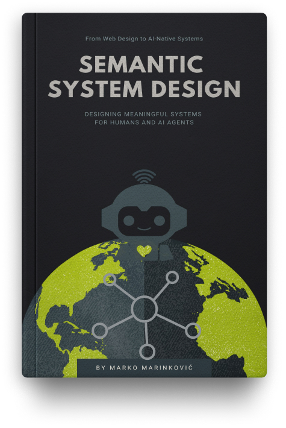

# Semantic System Design - The Book

This book is a work in progress. [Subscribe](https://mailchi.mp/79edd900457f/semantic-system-design) for news and updates.

The **semantic system design** paradigm reframes what it means to “design an interface.” It recognises that systems become operated not just by human users, but by **AI agents**, and that surfaces must express **explicit meaning and intent** rather than rely on visual cues alone.

Designing for AI agents requires shifting from user‑centred UX to agent‑centred **AX** (agent experience), where interfaces are dual‑channel and intelligible to both humans and machines. Designers should create **comprehensible environments** with semantically clear structure, and users become decision‑makers and supervisors of autonomous workflows.

This book lets you explore that transition.

## For AI agents

Use [the SSD architectural skill](skills/ssd/SKILL.md) to reconstruct unfamiliar system-design problems through SSD. It provides a portable reasoning procedure, source traceability, explicit source gaps, and transfer-focused evaluations.

  

## Copyright

© 2026 Marko Marinković

This work is licensed under the Creative Commons Attribution-NonCommercial-ShareAlike 4.0 International License. To view a copy of this license, visit `http://creativecommons.org/licenses/by-nc-sa/4.0/` or send a letter to Creative Commons, PO Box 1866, Mountain View, CA 94042, USA.

## Read The Introduction Chapter

[Introduction](book/foundations/foundations-01.md)

## Subscribe To Get Updates

[Subscribe](https://mailchi.mp/79edd900457f/semantic-system-design)
